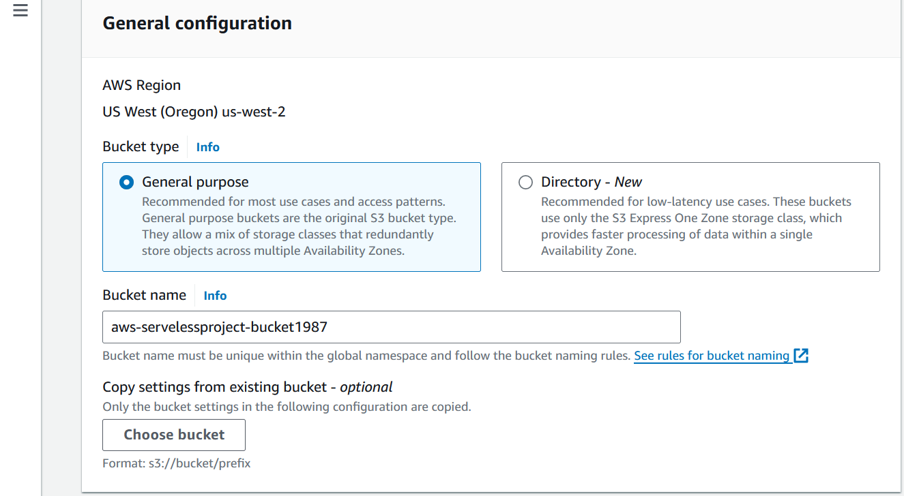
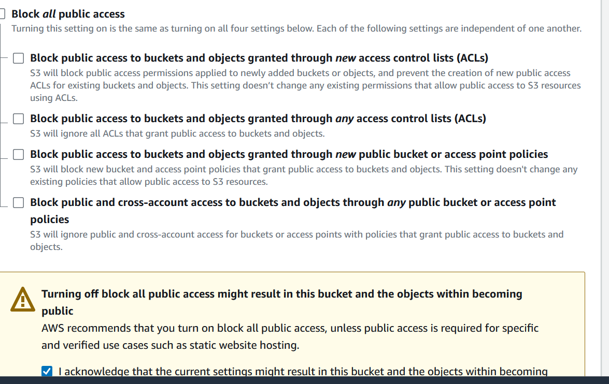
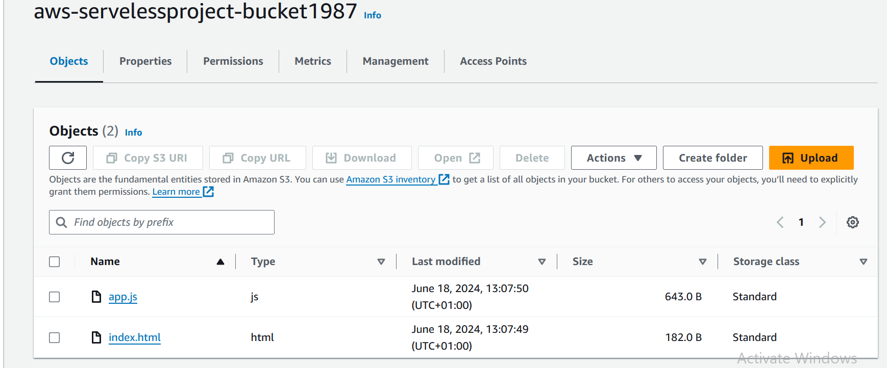
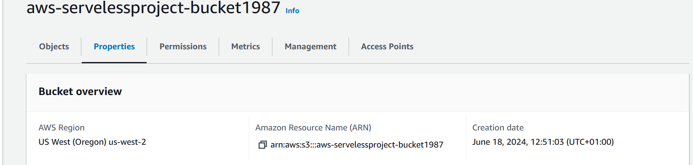
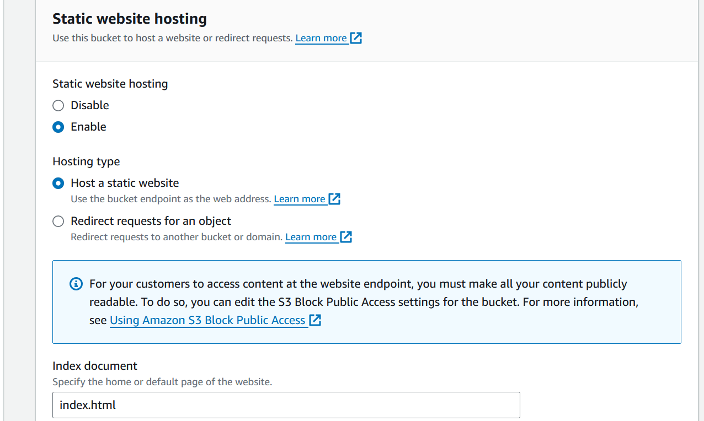
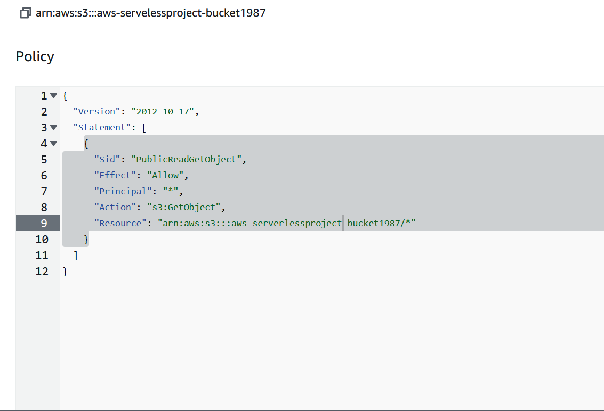
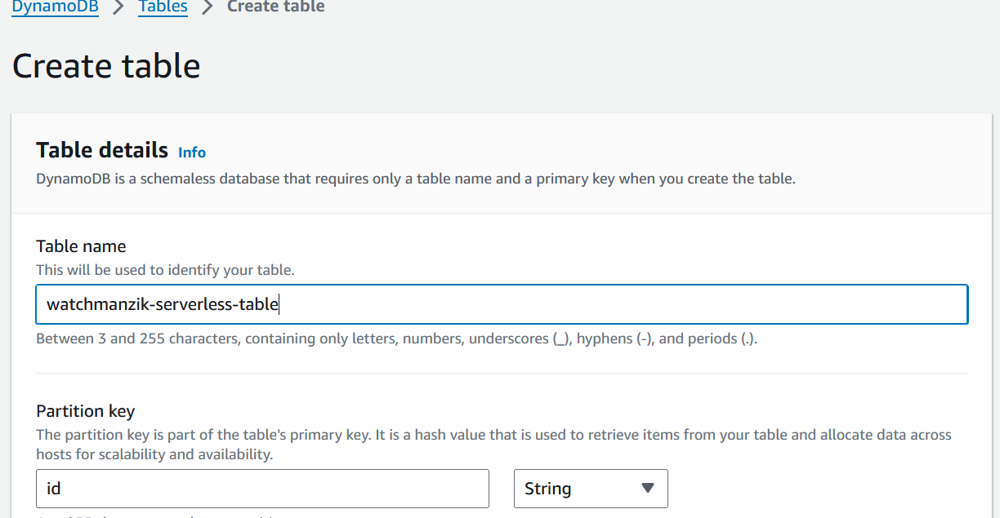

# AWS-Serverless-Project

# Building an AWS Serverless Project


1. Introduction to our project

In this project, we are going to build a simple serverless application using AWS services.
This tutorial is going to give you a introductory understanding to serverless architecture
and important AWS services. I hope you will enjoy it!

2. Services that we are going to use in this project

Amazon S3 (Simple Storage Service): serves as our application’s frontend hosting solution.
It stores and delivers static web content, such as HTML, CSS, JavaScript and images, ensuring
reliable and scalable delivery of these resources to users accessing the application via the internet.


AWS Lambda: as our backend’s serverless compute service. It executes code in response to various
events, such as HTTP requests, file uploads, and database updates, managing the application’s logic
and data processing without the need to manage traditional servers.

Amazon API Gateway: acts as a communication bridge between the frontend and backend of our application.
API Gateway handles incoming requests from clients, directing them to the appropriate backend resources, 
in our case, our Lambda function.

Amazon DynamoDB: serves as our application’s NoSQL database solution. It stores and manages structured
data with flexible schemas, enabling fast and scalable storage and retrieval of application data.

3. Setup

We have to create some files to our frontend. So here is the code for you:

index.html

```
<!DOCTYPE html>
<html>
<head>
<title>User Management</title>
<script src="app.js"></script>
</head>
<body>
<h1>List of Users</h1>
<div id="usersList"></div>
</body>
</html>
```

app.js


```
window.onload = function() {
    fetch('YOUR_API_GATEWAY_URL')
        .then(response => response.json())
        .then(data => {
            const usersList = document.getElementById('usersList');
            const users = data.body;
            users.forEach(user => {
                const userDiv = document.createElement('div');
                userDiv.textContent = `ID: ${user.id}, First Name: ${user.firstname}, Last Name: ${user.lastname}, Occupation: ${user.occupation}`;
                usersList.appendChild(userDiv);
            });
        })
        .catch(error => console.error('Error fetching data:', error));
};
```

4. Creating a S3 bucket

We are going to use a S3 bucket to host our frontend application, so first, go to the S3 
service and click to create a new bucket. In the new page, you have to choose a region and
a unique name for your bucket





Our bucket should be accessible publicly. So let’s uncheck the “Block all
public access” option. And check the warning below.





After creating your bucket, click on its name. In my case, I will click on
“aws-serverlessproject-bucket-1987.


On the new page, upload the index.html and the app.js that we created at the Setup stage.





Now, click on the Properties tab and scroll down until Static website hosting and click on Edit.





On the edit dialog, check Enable for Static website hosting and 
type index.html for the index document and save changes.





Now go to the Permissions tab so we can add a bucket policy. On the bucket
policy part, click on edit and add the following policy. Remember to change 
to your bucket name on the resource field. And then, you can save changes.

```
{
  "Version": "2012-10-17",
  "Statement": [
    {
      "Sid": "PublicReadGetObject",
      "Effect": "Allow",
      "Principal": "*",
      "Action": "s3:GetObject",
      "Resource": "arn:aws:s3:::YOUR-BUCKET-NAME/*"
    }
  ]
}
```





5. Setting up a DynamoDB table

We have to pull our data from somewhere, so it’s going to be from a DynamoDB table.
Let’s jump into the service and create a new table. Give it a name and type “id” at
the Partition key section. You can leave the rest as default.





Wait a few moments for your database to come up.
And then check it, go to Actions and Explore items.
