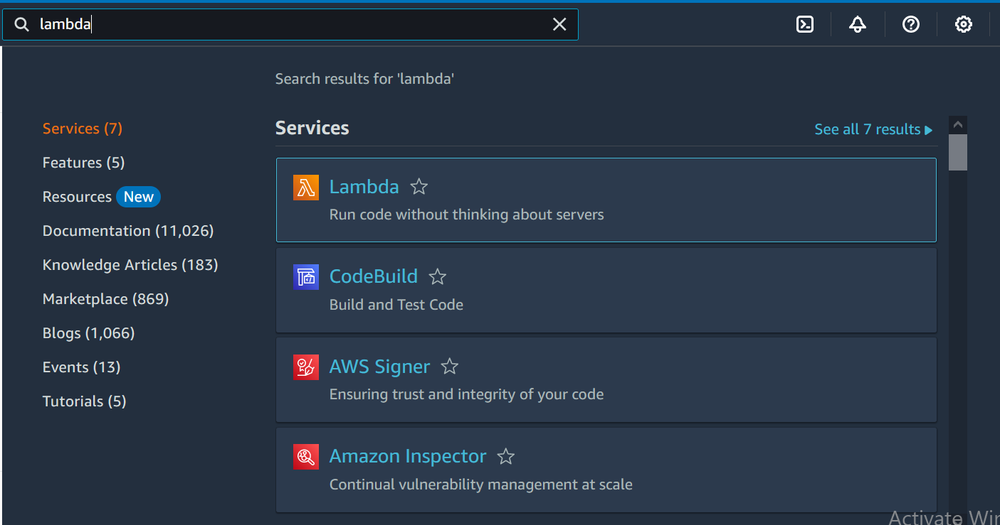
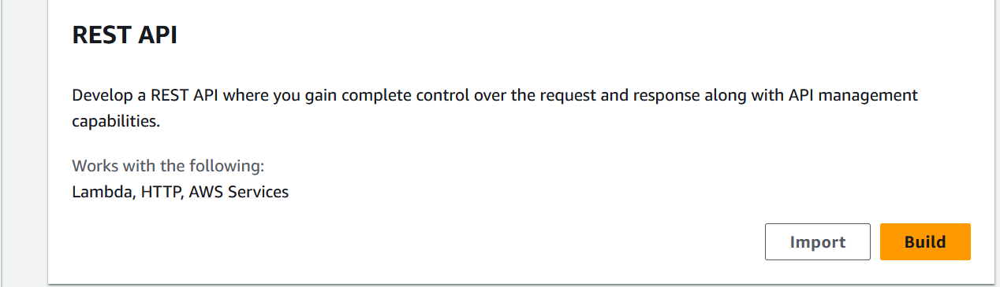
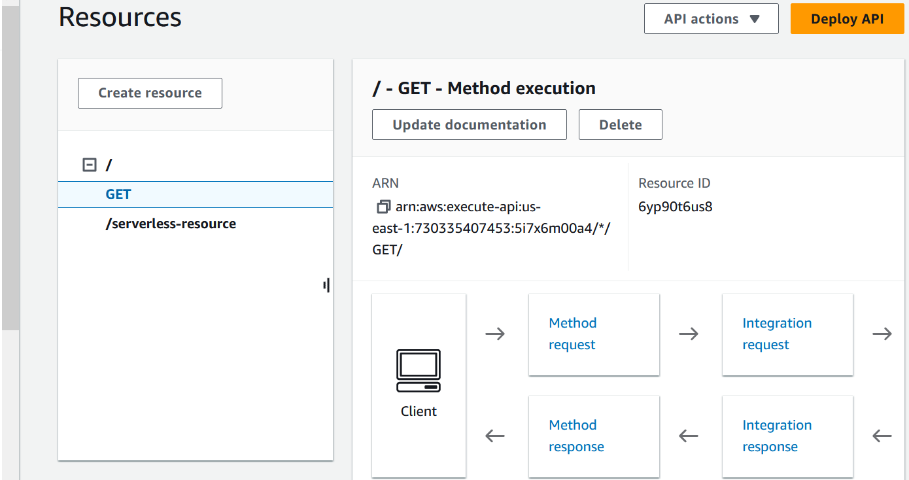
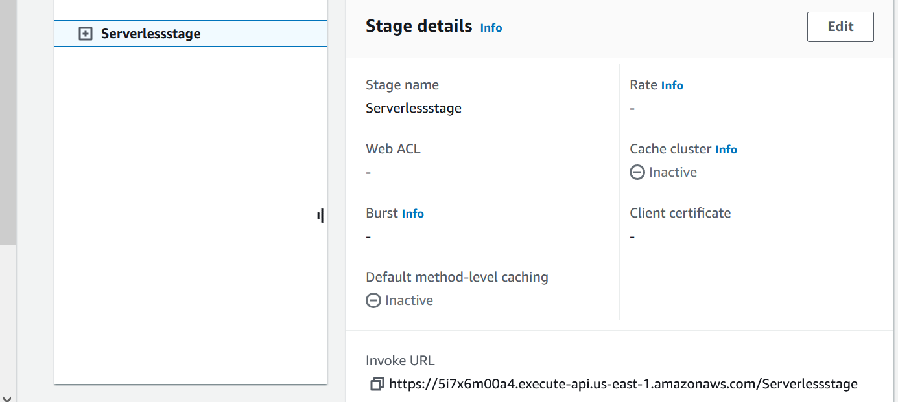

# AWS-Serverless-Project

# Building an AWS Serverless Project


1. Introduction to our project

In this project, we are going to build a simple serverless application using AWS services.
This tutorial is going to give you a introductory understanding to serverless architecture
and important AWS services. I hope you will enjoy it!

2. Services that we are going to use in this project

Amazon S3 (Simple Storage Service): serves as our application’s frontend hosting solution.
It stores and delivers static web content, such as HTML, CSS, JavaScript and images, ensuring
reliable and scalable delivery of these resources to users accessing the application via the internet.


AWS Lambda: as our backend’s serverless compute service. It executes code in response to various
events, such as HTTP requests, file uploads, and database updates, managing the application’s logic
and data processing without the need to manage traditional servers.

Amazon API Gateway: acts as a communication bridge between the frontend and backend of our application.
API Gateway handles incoming requests from clients, directing them to the appropriate backend resources, 
in our case, our Lambda function.

Amazon DynamoDB: serves as our application’s NoSQL database solution. It stores and manages structured
data with flexible schemas, enabling fast and scalable storage and retrieval of application data.

3. Setup

We have to create some files to our frontend. So here is the code for you:

index.html

```
<!DOCTYPE html>
<html>
<head>
<title>User Management</title>
<script src="app.js"></script>
</head>
<body>
<h1>List of Users</h1>
<div id="usersList"></div>
</body>
</html>
```

app.js


```
window.onload = function() {
    fetch('YOUR_API_GATEWAY_URL')
        .then(response => response.json())
        .then(data => {
            const usersList = document.getElementById('usersList');
            const users = data.body;
            users.forEach(user => {
                const userDiv = document.createElement('div');
                userDiv.textContent = `ID: ${user.id}, First Name: ${user.firstname}, Last Name: ${user.lastname}, Occupation: ${user.occupation}`;
                usersList.appendChild(userDiv);
            });
        })
        .catch(error => console.error('Error fetching data:', error));
};
```

4. Creating a S3 bucket

We are going to use a S3 bucket to host our frontend application, so first, go to the S3 
service and click to create a new bucket. In the new page, you have to choose a region and
a unique name for your bucket


Our bucket should be accessible publicly. So let’s uncheck the “Block all
public access” option. And check the warning below.


After creating your bucket, click on its name. In my case, I will click on
“aws-serverlessproject-bucket-1987.


On the new page, upload the index.html and the app.js that we created at the Setup stage.


Now, click on the Properties tab and scroll down until Static website hosting and click on Edit.


On the edit dialog, check Enable for Static website hosting and 
type index.html for the index document and save changes.


Now go to the Permissions tab so we can add a bucket policy. On the bucket
policy part, click on edit and add the following policy. Remember to change 
to your bucket name on the resource field. And then, you can save changes.

```
{
  "Version": "2012-10-17",
  "Statement": [
    {
      "Sid": "PublicReadGetObject",
      "Effect": "Allow",
      "Principal": "*",
      "Action": "s3:GetObject",
      "Resource": "arn:aws:s3:::YOUR-BUCKET-NAME/*"
    }
  ]
}
```


5. Setting up a DynamoDB table

We have to pull our data from somewhere, so it’s going to be from a DynamoDB table.
Let’s jump into the service and create a new table. Give it a name and type “id” at
the Partition key section. You can leave the rest as default.


Wait a few moments for your database to come up.
And then check it, go to Actions and Explore items.


In this new section, we are going to add items to our DynamoDB table, so we 
can display them on our frontend. Click on Create item and wait for the
dialog to open.

Select JSON view on the right side, add the JSON below for each item at a time, and save changes.

```
  {
    "id": {"S": "1"},
    "firstname": {"S": "John"},
    "lastname": {"S": "Doe"},
    "occupation": {"S": "Engineer"}
  }
  ```


```
  {
    "id": {"S": "2"},
    "firstname": {"S": "Jane"},
    "lastname": {"S": "Smith"},
    "occupation": {"S": "Designer"}
  }
```

```
  {
    "id": {"S": "3"},
    "firstname": {"S": "Michael"},
    "lastname": {"S": "Johnson"},
    "occupation": {"S": "Developer"}
  }
```


6. Configuring a Lambda function

For our backend, we are going to use a Lambda function. So let’s access Lambda service
and create a new function. Give it a name and choose Python 3.12 as the runtime. 
Than proceed to create it.

click on Lambda





In the new page, scroll down to the Code source section, and add
the following code snippet. Then click in Deploy.


```
import boto3

def lambda_handler(event, context):
    dynamo = boto3.resource('dynamodb').Table('aws-serverless-project-table')
    data = dynamo.scan()
    p
    response = {
        'statusCode': 200,
        'body': data['Items']
    }
    
    return response
```


After doing that, we have to give permission to our Lambda function to access 
our DynamoDB table. Click on the Configuration tab, then Permissions.


Click on Add permissions and Attach policies.
Then click on the "Role name"


Type DynamoDB on the search bar, and check the AmazonDynamoDBFullAccess policy. 
And finally, click on Add permissions.


7. Deploying our API Gateway

To serve as our bridge between frontend (S3) and backend (Lambda), we are using
API Gateway. Access the API Gateway service page, and seach for Rest API, and click Build.


click on Apigateway





Give a name to your API Gateway and leave the rest as default. 
You can click on Create API.


Now, we have to click on Create resource, at the left corner of the page.


Give it a name, and click on Create resource.


Let’s click on Create method.


Select the Method type as GET, and select the Integration type as Lambda Function. 
Below, you will have to select the Lambda function that you have just created.
And then you can proceed.


Now you can click on Deploy API.





On the new dialog, select New Stage, and give it a name. And then, deploy it.


After deploying, click on the resource that you created and click on Enable CORS.


Select GET, click save, and Deploy your API Gateway again. You can use the stage that was created before.


After doing it, search for invoke URL and copy it.





We have to edit our app.js file, to include this Invoke URL. If you open app.js locally,
you will find a place to include it. You have to include your resource name at the end of the URL.

For instance, here is my app.js updated:


```
window.onload = function() {
    fetch('https://5i7x6m00a4.execute-api.us-east-1.amazonaws.com/Serverlessstage')
        .then(response => response.json())
        .then(data => {
            const usersList = document.getElementById('usersList');
            const users = data.body;
            users.forEach(user => {
                const userDiv = document.createElement('div');
                userDiv.textContent = `ID: ${user.id}, First Name: ${user.firstname}, Last Name: ${user.lastname}, Occupation: ${user.occupation}`;
                usersList.appendChild(userDiv);
            });
        })
        .catch(error => console.error('Error fetching data:', error));
};
```

After doing it, go back to your S3 bucket, delete the app.js, and upload the updated one.


8. Testing our application

To test our application, we have to find our bucket URL. On your bucket page, go to Properties
and scroll down until you find Static website hosting. There you can find your bucket URL.


After opening it, check if the users are displayed on the page and if so,
congratulations, you just finished your project!


